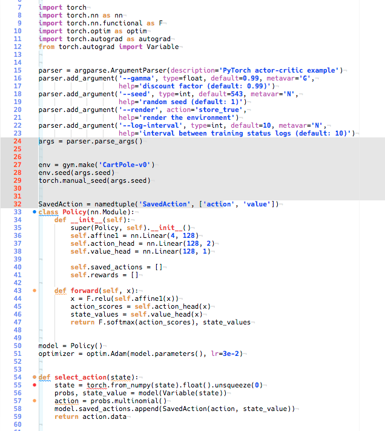

# contrast-light-syntax

High contrast light syntax theme for ATOM editor. Especially for Python.
Code are based on [darkpython-syntax-theme](https://github.com/tryexceptpass/darkpython-syntax).

## Screenshot
Example code with this theme. 

